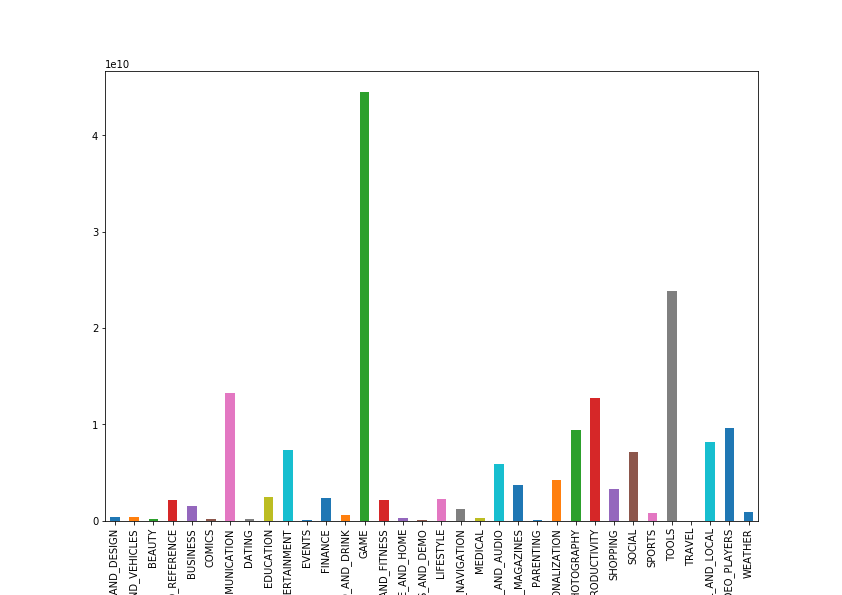
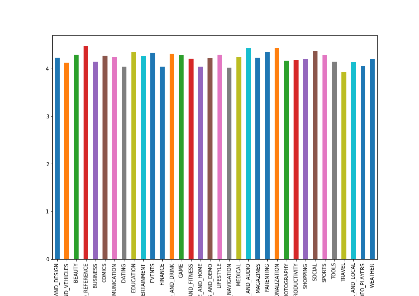
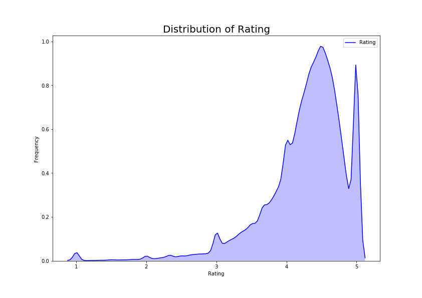
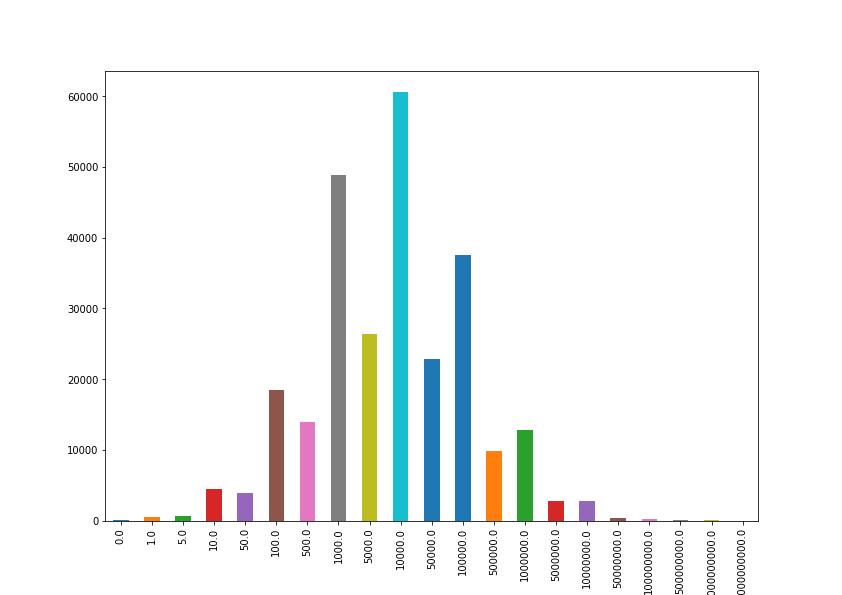
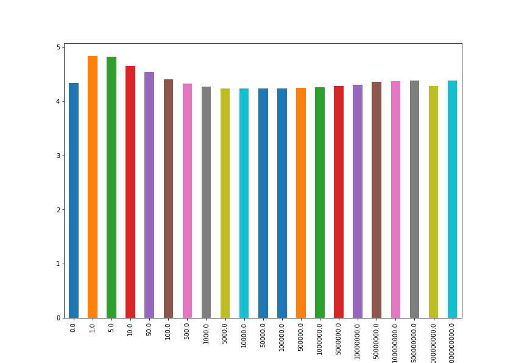
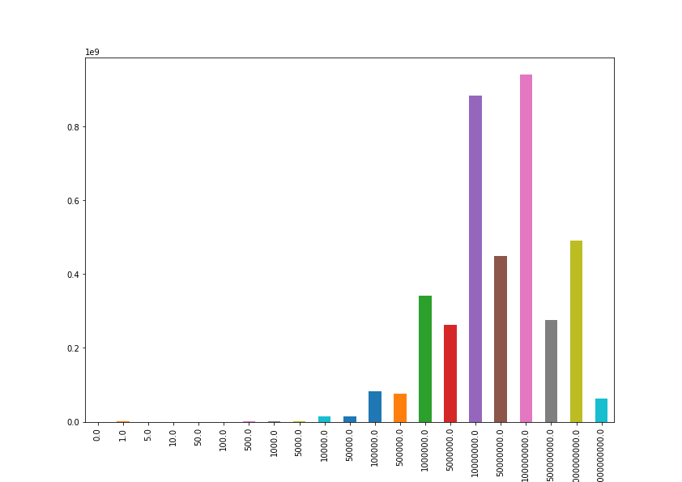
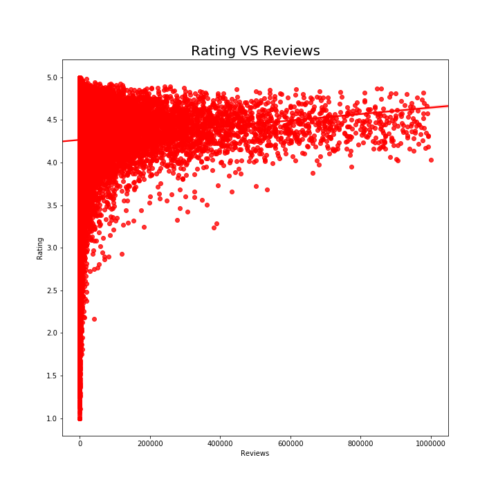

# Google-Play-Store-Apps
Utilized Python3, Jupyter Notebook, Pandas library, and Seaborn to clean, explore, and visualize sample data of applications available on Google Play Store. Analysis was done to determine if there were any correlations between the number of downloads an application received and independent variables of category, rating, and reviews.

